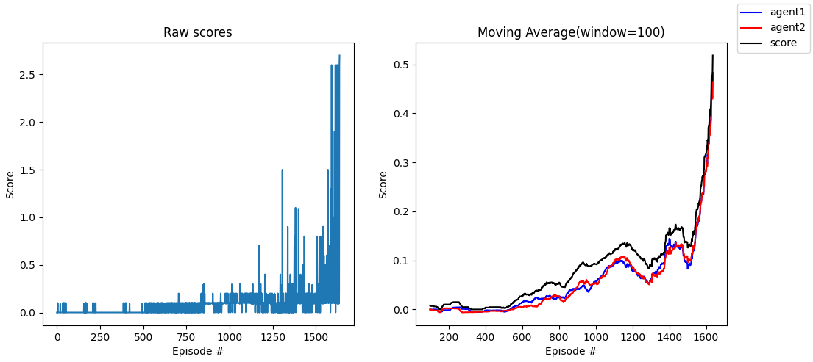

[//]: # (Image References)

[image1]: https://user-images.githubusercontent.com/10624937/42135623-e770e354-7d12-11e8-998d-29fc74429ca2.gif "Trained Agent"

[image2]: https://user-images.githubusercontent.com/10624937/42135622-e55fb586-7d12-11e8-8a54-3c31da15a90a.gif "Soccer"

# Project 3: Collaboration and Competition

### Links:

- [Tennis.py](./Tennis.py)
- [Report.pdf](./docs/Report.pdf)
- Saved model weights
    - [Actor network weights](./weights/checkpoint-actor1.pth)
    - [Critic network weights (agent 1)](./weights/checkpoint-critic1.pth)
    - [Critic network weights (agent 2)](./weights/checkpoint-critic2.pth)
- [Installation Instructions](#installation-instructions)
- [My Implementation](#my-implementation)
- [Console logs](./docs/result.log)

### Introduction

For this project, you will work with
the [Tennis](https://github.com/Unity-Technologies/ml-agents/blob/master/docs/Learning-Environment-Examples.md#tennis)
environment.

![Trained Agent][image1]

In this environment, two agents control rackets to bounce a ball over a net. If an agent hits the ball over the net, it
receives a reward of +0.1. If an agent lets a ball hit the ground or hits the ball out of bounds, it receives a reward
of -0.01. Thus, the goal of each agent is to keep the ball in play.

The observation space consists of 8 variables corresponding to the position and velocity of the ball and racket. Each
agent receives its own, local observation. Two continuous actions are available, corresponding to movement toward (or
away from) the net, and jumping.

The task is episodic, and in order to solve the environment, your agents must get an average score of +0.5 (over 100
consecutive episodes, after taking the maximum over both agents). Specifically,

- After each episode, we add up the rewards that each agent received (without discounting), to get a score for each
  agent. This yields 2 (potentially different) scores. We then take the maximum of these 2 scores.
- This yields a single **score** for each episode.

The environment is considered solved, when the average (over 100 episodes) of those **scores** is at least +0.5.

### Installation Instructions

1. Download the environment from one of the links below. You need only select the environment that matches your
   operating system:
    - Linux: [click here](https://s3-us-west-1.amazonaws.com/udacity-drlnd/P3/Tennis/Tennis_Linux.zip)
    - Mac OSX: [click here](https://s3-us-west-1.amazonaws.com/udacity-drlnd/P3/Tennis/Tennis.app.zip)
    - Windows (32-bit): [click here](https://s3-us-west-1.amazonaws.com/udacity-drlnd/P3/Tennis/Tennis_Windows_x86.zip)
    - Windows (
      64-bit): [click here](https://s3-us-west-1.amazonaws.com/udacity-drlnd/P3/Tennis/Tennis_Windows_x86_64.zip)

   (_For Windows users_) Check
   out [this link](https://support.microsoft.com/en-us/help/827218/how-to-determine-whether-a-computer-is-running-a-32-bit-version-or-64)
   if you need help with determining if your computer is running a 32-bit version or 64-bit version of the Windows
   operating system.

   (_For AWS_) If you'd like to train the agent on AWS (and have
   not [enabled a virtual screen](https://github.com/Unity-Technologies/ml-agents/blob/master/docs/Training-on-Amazon-Web-Service.md))
   , then please use [this link](https://s3-us-west-1.amazonaws.com/udacity-drlnd/P3/Tennis/Tennis_Linux_NoVis.zip) to
   obtain the "headless" version of the environment. You will **not** be able to watch the agent without enabling a
   virtual screen, but you will be able to train the agent.  (_To watch the agent, you should follow the instructions
   to [enable a virtual screen](https://github.com/Unity-Technologies/ml-agents/blob/master/docs/Training-on-Amazon-Web-Service.md)
   , and then download the environment for the **Linux** operating system above._)

2. Place the file in this repository and unzip (or decompress) the file.

3. Create (and activate) a new environment with Python 3.6.

    - __Linux__ or __Mac__:
   ```bash
   conda create --name drlnd python=3.6
   source activate drlnd
   ```
    - __Windows__:
   ```bash
   conda create --name drlnd python=3.6 
   activate drlnd
   ``` 
4. Install the dependencies:
   ```bash 
   cd python
   pip install .
   pip install pandas
   ```
   If you get the error message that torch=0.4.0 could not be found, try the following
   ```bash
   conda install pytorch=0.4.0 -c pytorch
   ```
5. Run the `Tennis.py` file.

### My implementation

The resulting trained agent looks like the following:


The training loop for both DDPG Agents can be found in [Tennis.py](Tennis.py). All hyperparameters can be defined by
passing it into the constructor of the Agent class. The boolean `watch_only` can be used to either train or watch the
agent.

```python
# Create the two agents
_agent1 = Agent(_state_size, _action_size,
                gamma=0.994, lr_critic=0.0005, tau=0.001, weight_decay=0.)
_agent2 = Agent(_state_size, _action_size,
                gamma=0.994, lr_critic=0.0005, tau=0.001, weight_decay=0.)

# set the same actor network for both agents
_actor_local = ActorNetwork(_state_size, _action_size)
_actor_target = ActorNetwork(_state_size, _action_size)
_actor_optimizer = optim.Adam(_actor_local.parameters(), lr=0.001)
_agent1.actor_target = _actor_target
_agent2.actor_target = _actor_target
_agent1.actor_local = _actor_local
_agent2.actor_local = _actor_local
_agent1.actor_optimizer = _actor_optimizer
_agent2.actor_optimizer = _actor_optimizer
_agent1.hard_update(_actor_local, _actor_target)
_agent2.hard_update(_actor_local, _actor_target)

# combine the two agents (this class will also store the shared ReplayBuffer)
_agent_duo = AgentDuo(_agent1, _agent2, buffer_size=1000000, batch_size=150)

watch_only = False
if watch_only:
    watch_agents_from_pth_file(_env, _brain_name, _agent_duo, './weights')
else:
    _scores = train_agents(_env, _brain_name, _agent_duo, n_episodes=2000)
    plot_scores(scores=_scores, sma_window=100)
    watch_agents(_env, _brain_name, _agent_duo, episodes=10)
```

After training the agent the following score chart should be plotted.



